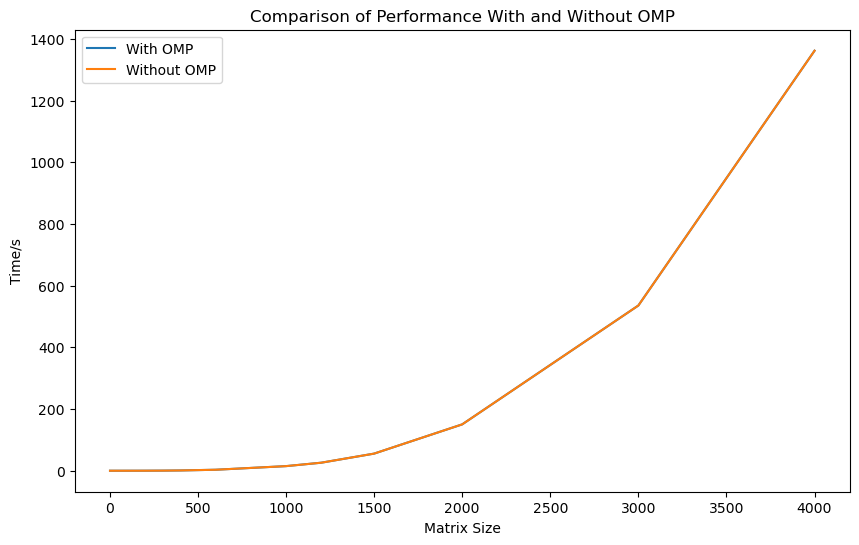
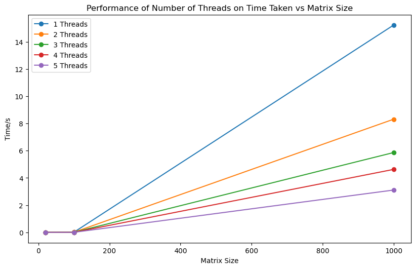
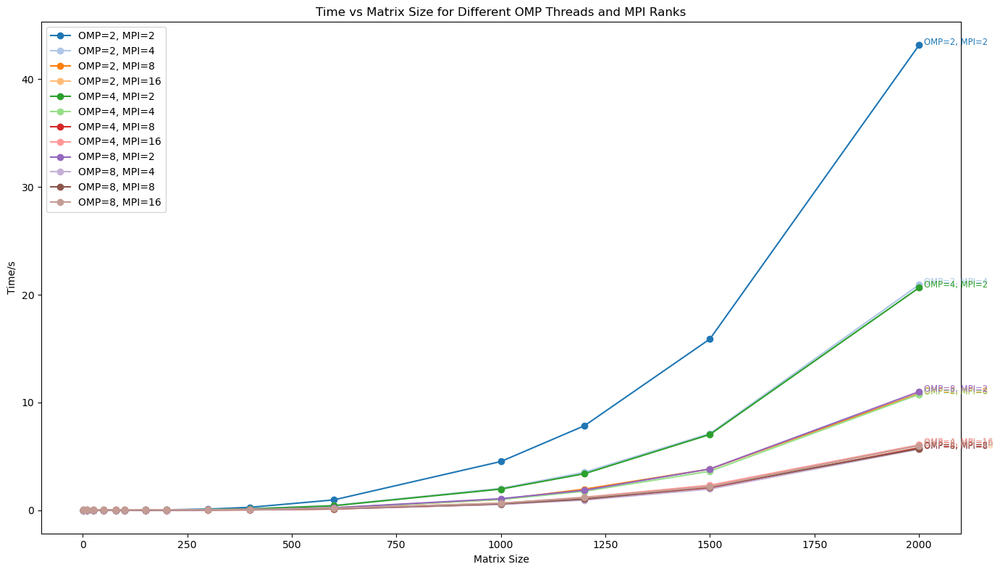

### Part 1
Q2.  
  
Yes, we expect the performance to be the same since both is running with 1 thread.  

Q3.  
  
We can see that when matrix size is small, parallelizing threads does not make any difference. As matrix size increases, the effect of having more threads is more apparent. This is because larger matrices offer "parts of matrix" threads to work on different parts of the computation simultaneously, leading to more efficient utilization of resources.  
  
Q5.  
A detail comparison is provided at Part 1/q5output.txt. There is no difference in the matrix produced.  

### Part 2
Hello world! from process: 1, thread: 0
Hello world! from process: 1, thread: 2
Hello world! from process: 1, thread: 1
Hello world! from process: 1, thread: 3

Hello world! from process: 0, thread: 1
Hello world! from process: 0, thread: 2
Hello world! from process: 0, thread: 0
Hello world! from process: 0, thread: 3
After finalize, from rank: 0

Process 1 Threads: The lines with "from process: 1" are the output from the MPI process with rank 1. This process has spawned 4 OpenMP threads, and each thread prints its ID (0 to 3). The order in which these threads complete their execution and print the output can vary, which is why you see the thread IDs not in sequence (0, 2, 1, 3). This is a common characteristic of concurrent execution.

Process 0 Threads: Similarly, the lines with "from process: 0" are from the MPI process with rank 0. This process also has 4 threads, and they have printed their messages in a similarly mixed order (1, 2, 0, 3).

### Part 3

On general, as the matrix size increases, the time to solve generally increases. This is expected because larger matrices require more computations.  
When matrix size is small (less than 400), having more OMP or MPI threads has little to no effect on the runtime, as the computational workload for each operation is relatively low and the overheads offsets the time saved from parallelism.  
Let number of OMP threads be x and number of MPI threads be y.  
When x*y is larger, the runtime will be faster as there are more threads in parallel to process the calculations.  
As long as x*y is the same, different combination of x and y will not result in a difference in performance as the total number of threads will be the same.  
For x*y > 16, any increase in number of threads for OMP or MPI will not reduce runtime as the program is already at its optimal.
